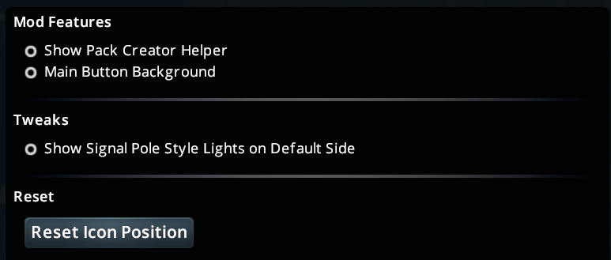

To open, press the esc key, click "Options". Then scroll down in the list and find the Traffic Light Replacer entry

(just mention its in the game's options menu?)
# Table of Contents
{: .no_toc}

* TOC
{:toc}

# Mod Features

## Show Pack Creator

Shows the pack creator helper window, enable this when [making new traffic light packs](/documentation/pack-creation/#pack-creator-helper)

## Main Button Background

Enable this to change the mod icon to have a background, this is helpful if you want to move the mod button to a location outside the bottom bar.

When enabled the icon looks like this:

To move the icon, right click and drag

# Tweaks
## Show Signal Pole Style Lights on Default Side

Shows the Signal Pole prop on the opposite side of the stop line when MultiSize traffic lights are on the default side of the stop line

Example with NATL Yellow Style Lights:

Setting off:

 

Setting on:
 

# Reset
## Reset Button Position

Resets the button position to the default location in the bottom bar

