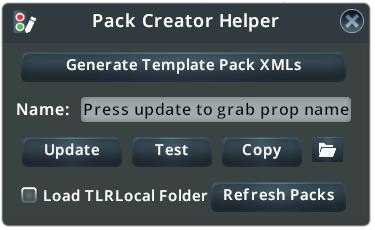

Information about how to make packs

# Table of Contents
{: .no_toc}

* TOC
{:toc}

# Props

## General
Before creating a traffic light pack, traffic light props are needed. For general prop asset creation information refer to this [article on cslm](https://cslmodding.info/asset/prop/) 

If you already have working traffic light props skip to [here](/documentation/pack-creation/#xml-types) ??
## Traffic Light Prop Specifics

Traffic lights props use a special shader, the Traffic Light Shader. 

Because of this it is best to use the vanilla traffic light template since it already has that configured

## Preparation
Before making a XML file, it is suggested to publish your traffic light props as an unlisted listing

This is because the mod refers to the Prefab name of the prop, which differs whether the prop is published or not.

# XML Types

This mod can read two different kinds of XML configuration files

## OneSize
For traffic light packs that replace vanilla traffic light props one to one. This is best for legacy/limited prop packs

## MultiSize
For packs that have traffic lights for different road sizes/ have several variations per road size. This requires more prop models than the OneSize format, but it can take full advantage of the mod's features

# XML Template

As a starting point to make a new configuration, use these blank XML templates [here](https://github.com/Cgameworld/TrafficLightReplacer/tree/master/TrafficLightReplacer/Templates) or export them using the mod's [Pack Creator Helper](/documentation/pack-creation/#pack-creator-helper)

If you are on Windows, [Notepad++](https://notepad-plus-plus.org/downloads/) with the XMLTools plugin is recommended to edit these files, since it includes features such as text highlighting, syntax checking and pretty printing.  

Example Blank XML Template:\


For examples of fully working xml files, look at the mod's [internal XML presets](https://github.com/Cgameworld/TrafficLightReplacer/tree/master/TrafficLightReplacer/DefaultXMLS)

Read below for the explaination of the elements

# XML Elements

### PackName
The name of the pack shown in game

### OneSize
[Type](#xml-types) of XML file, ```true``` means it is a OneSize configuration, ```false``` means it is a MultiSize configuration

### Prefab
Prefab name of the prop, use the update/copy buttons in the Pack Creator Helper to grab


### Type
Defines the type of prop to replace

For **OneSize** files, types can be set to ```Main``` , ```Mirror``` , ```Ped Signal```, ```Signal Pole```, or ```Signal Pole Mirror``` with only one prop per type.

- All the types (Main, Mirror, Ped Signal, Signal Pole) need to be assigned to a prop, otherwise the pack will not work
- In the case of Signal Pole Mirror, if left blank the mod will use the non-mirrored signal pole prop

For **MultiSize** files types can be set to ```Small```, ```Medium```, ```Large```, ```All``` , or ```Signal Pole``` .

- Types Small, Medium and Large and All can be assigned to multiple props, while Signal Pole can only be assigned to one prop
- Type All means that the prop is added to all size categories
- The XML file is required to have at least one prop assigned to types (Small, Medium and Large, Signal Pole) or (All, Signal Pole), otherwise the pack will not work

### Name
Name of the prop shown in the customization dropdown (**MultiSize only**)

### Description
Tooltip shown in the customization dropdown (**MultiSize only**)

### Transform
(**optional**)\
\
Default transform settings for the pack

### DropdownSelectionIndex
(**optional, MultiSize only**)\
\
Default variation selected for each size in the customization menu. Use this if you want something other than the first prop for a size category selected when loading the pack\
\
**SmallRoads** - index for Small Roads dropdown\
**MediumRoads** - index for Medium Roads dropdown\
**LargeRoads** - index for Large Roads dropdown

index values start at 0\
\
Example:\
\
To have the second traffic light in this list to be selected on default, change the MediumRoads element value to ```1```

### ForceDefaultSideSignalPole
(**optional, MultiSize only**)\
Forces the signal pole light to be always at the opposite side of the road when the default side is enabled, instead of only when the optional setting in the global option menu settings is enabled (only used in special cases) 


# Pack Creator Helper

In the mod, there's a toolbox window that helps with making an XML file for the mod called the Pack Creator Helper. To show it, go into the [general mod settings](/documentation/settings/), and enable "Show Pack Creator Helper"


Once enabled you should see a window that looks like this:



## Generate Template Pack XMLS

This button exports two XML files, one for each configuration [type](/documentation/pack-creation/#xml-types)

## Update
This copies the selected prop's name into the name box. Use the [Find It! 2](https://steamcommunity.com/sharedfiles/filedetails/?id=2133885971) mod to search and to select a prop

## Copy

Copies the prop name to the clipboard

## Folder Icon

Opens the TLRLocal folder, place XML files you want to test here

## Load TLRLocal Folder

Toggles whether to load XML files in the TLRLocal folder to the Pack dropdown

## Refresh Packs

Refreshes the main Pack Dropdown

# XML Loading Locations

The mod reads XML files from the following places:

```C:\Program Files (x86)\Steam\steamapps\workshop\content\255710``` (any enabled/subscribed subfolder) \
file in workshop folder has to named TLRLocal.xml

```\AppData\Local\Colossal Order\Cities_Skylines\TLRLocal``` \
can be named anything ("Load TLRLocal Folder" in the asset creator helper needs to be enabled)

# Testing a Traffic Pack

In the TLRLocal folder first complete setting up a XML config file,

Then check the "Load TLRLocal Folder" checkbox in the Pack Creator Helper. Then click "Refresh Packs"

If everything works, the lights should replace. If not an error message will appear.

Then test with various sized roads and see if it replaces well. One common thing to fix is the rotation. Use the rotate slider in the [Transform Settings](/documentation/main-window/#transform-settings) to preview the changes, then in the XML file change the values within the optional Transform tag.


# Publishing

After making sure the XML file works, go to the Content Manager and update the existing prop pack. Then at the update popup open the asset staging folder and copy the XML from the TLRLocal Folder and rename it TLRConfig.xml.

add images!

# Replacement Limitations

- Left Hand Drive is not supported at all
- MultiSize packs do not support mirrored traffic lights, they are replaced with a blank prop
Example of mirror prop:\

- For pack variations that have mirrored lights in the median of roads like vanilla lights, use the OneSize XML type